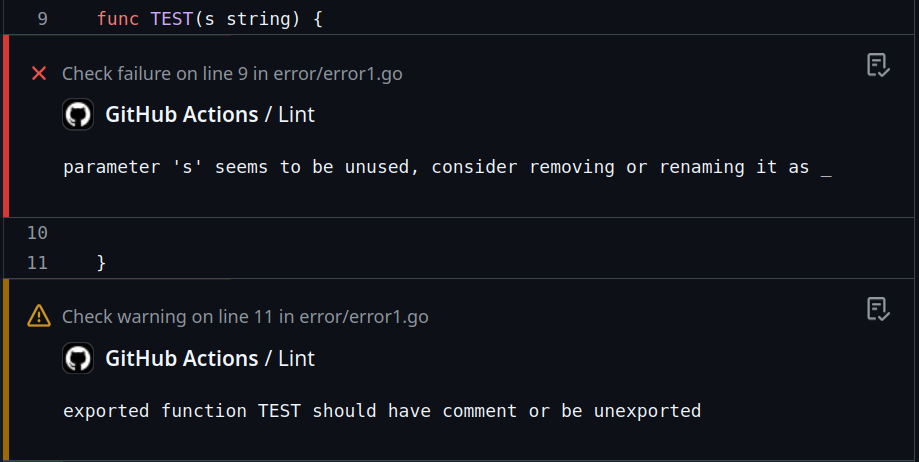

# Revive Action

This Action runs [Revive](https://github.com/mgechev/revive) on your [Go](https://golang.org/) code and adds annotations to the check.

## Usage

### Checkout

```YAML
- name: Check out code into the Go module directory
  uses: actions/checkout@v4
```

### Use by pulling pre-built image **(recommended)**

#### Docker Hub image

```YAML
- name: Run Revive Action by pulling pre-built image
  uses: docker://morphy/revive-action:v2
```

#### GitHub Container registry image

```YAML
- name: Run Revive Action by pulling pre-built image
  uses: docker://ghcr.io/morphy2k/revive-action:v2
```

### Use by building from repository

```YAML
- name: Run Revive Action by building from repository
  uses: morphy2k/revive-action@v2
```

### Configuration

```YAML
  with:
    # Path to your Revive config within the repo (optional)
    config: revive/config.toml

    # Exclude patterns (optional)
    exclude: |
      file.go
      foo/bar.go
      ./foo/bar/...

    # Path pattern (default: ./...)
    path: "./foo/..."

    # Fail on any issue. Overrides the error and warning code in config (default: false)
    fail-on-any: true
```

### Workflow example

```YAML
name: Lint

on:
  pull_request:
  push:
    paths:
      - '**.go'
      - 'go.mod'
      - 'go.sum'
      - 'revive.toml'

jobs:

  lint:
    name: Lint
    runs-on: ubuntu-latest
    steps:

    - name: Check out code into the Go module directory
      uses: actions/checkout@v4

    - name: Run Revive Action
      uses: docker://morphy/revive-action:v2
      with:
        config: revive.toml
```

## Screenshots



_GitHub Annotations_
